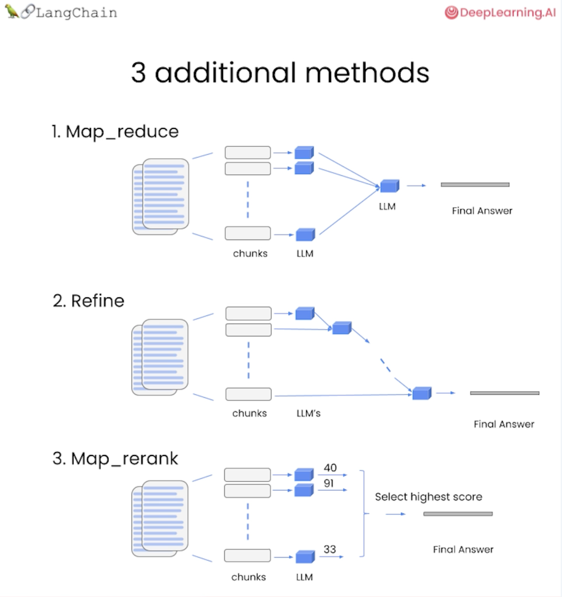

# Advanced Chain Types for Q&A Over Documents

## Overview
This document covers the 3 additional chain types available in LangChain's RetrievalQA that were **not** demonstrated in the L4 notebook. L4 only showed the "stuff" method, but there are more powerful alternatives for handling larger documents.



---

## The 4 Chain Types

### 1. Stuff (Covered in L4) ✅
**How it works:** Puts all retrieved documents into a single prompt.

```python
qa_chain = RetrievalQA.from_chain_type(
    llm=llm,
    chain_type="stuff",
    retriever=retriever
)
```

**Pros:**
- Simple and fast
- Single LLM call
- Works well for small documents

**Cons:**
- Limited by prompt size
- Fails if documents too large

**Use when:** Documents are small and fit in context window

---

## Advanced Methods (Not in L4)

### 2. Map_reduce 🔄
**How it works:** Process each document chunk separately, then combine results.


**Flow:**
```
Document → Split into chunks
    ↓
Chunk 1 → LLM → Answer 1
Chunk 2 → LLM → Answer 2    } Parallel processing
Chunk 3 → LLM → Answer 3
    ↓
All answers → Final LLM → Combined Final Answer
```

**Code:**
```python
from langchain.chains import RetrievalQA
from langchain.chat_models import ChatOpenAI

llm = ChatOpenAI(temperature=0)

qa_chain = RetrievalQA.from_chain_type(
    llm=llm,
    chain_type="map_reduce",  # ← Use map_reduce
    retriever=retriever,
    verbose=True
)

response = qa_chain.run("Your question here")
```

**Pros:**
- Handles very large documents
- Parallel processing (faster)
- No token limit issues

**Cons:**
- Multiple LLM calls (more expensive)
- May lose context between chunks

**Use when:** 
- Documents are too large for "stuff"
- You have many documents to process
- Speed is important (can parallelize)

**Example Scenario:**
```python
# Analyzing a 100-page research paper
qa_chain.run("Summarize all the key findings")
# Each chapter processed separately, then combined
```

---

### 3. Refine 🔁
**How it works:** Iteratively refine the answer by processing chunks sequentially.


**Flow:**
```
Chunk 1 → LLM → Answer v1
    ↓
Answer v1 + Chunk 2 → LLM → Answer v2 (refined)
    ↓
Answer v2 + Chunk 3 → LLM → Answer v3 (refined)
    ↓
Final refined answer
```

**Code:**
```python
qa_chain = RetrievalQA.from_chain_type(
    llm=llm,
    chain_type="refine",  # ← Use refine
    retriever=retriever,
    verbose=True
)

response = qa_chain.run("Explain the main argument")
```

**Pros:**
- Maintains context across chunks
- Progressively improves answer quality
- Good for coherent narratives

**Cons:**
- Sequential (slower than map_reduce)
- Most expensive (many LLM calls)
- Later chunks may dominate answer

**Use when:**
- Answer quality is more important than cost
- Need coherent, refined responses
- Processing documents with connected information

**Example Scenario:**
```python
# Analyzing a novel's character development
qa_chain.run("How does the main character evolve?")
# Each chapter refines the understanding progressively
```

---

### 4. Map_rerank 🏆
**How it works:** Process chunks separately, score each answer, pick the best.


**Flow:**
```
Document → Split into chunks
    ↓
Chunk 1 → LLM → Answer 1 (Score: 40)
Chunk 2 → LLM → Answer 2 (Score: 91)  } Parallel processing
Chunk 3 → LLM → Answer 3 (Score: 33)
    ↓
Select highest score (91)
    ↓
Answer 2 selected as Final Answer
```

**Code:**
```python
qa_chain = RetrievalQA.from_chain_type(
    llm=llm,
    chain_type="map_rerank",  # ← Use map_rerank
    retriever=retriever,
    verbose=True
)

response = qa_chain.run("What is the best solution?")
```

**How scoring works:**
The LLM is prompted to:
1. Answer the question based on the chunk
2. Assign a confidence score (0-100)
3. System picks the highest-scoring answer

**Pros:**
- Gets the single best answer
- Fast (parallel processing)
- Good when answer is in one specific chunk

**Cons:**
- May miss information from other chunks
- Relies on LLM's self-scoring accuracy

**Use when:**
- Looking for a specific fact
- Answer is likely in one location
- Want the most confident answer

**Example Scenario:**
```python
# Finding a specific product in a large catalog
qa_chain.run("What is the cheapest waterproof jacket?")
# Scores each product match, returns the one with highest confidence
```

---

## Comparison Table

| Chain Type | LLM Calls | Speed | Cost | Best For |
|------------|-----------|-------|------|----------|
| **stuff** | 1 | ⚡⚡⚡ Fast | 💰 Cheap | Small docs |
| **map_reduce** | N+1 | ⚡⚡ Medium | 💰💰 Medium | Large docs, summaries |
| **refine** | N | ⚡ Slow | 💰💰💰 Expensive | Quality, coherence |
| **map_rerank** | N | ⚡⚡ Medium | 💰💰 Medium | Specific facts |

*N = number of chunks*

---

## When to Use Each Method

### Use "stuff" when:
- ✅ Retrieved documents are small
- ✅ All docs fit in prompt (< 4k tokens typically)
- ✅ Want simplest, fastest solution

### Use "map_reduce" when:
- ✅ Documents are very large
- ✅ Need to summarize multiple sources
- ✅ Want parallel processing for speed

### Use "refine" when:
- ✅ Need highest quality answer
- ✅ Documents have connected information
- ✅ Cost is not a concern

### Use "map_rerank" when:
- ✅ Looking for specific information
- ✅ Answer likely in one chunk
- ✅ Want confidence scoring

---

## Complete Example: Choosing the Right Chain

```python
from langchain.chains import RetrievalQA
from langchain.chat_models import ChatOpenAI
from langchain.vectorstores import DocArrayInMemorySearch
from langchain.embeddings import OpenAIEmbeddings

# Setup (same for all)
embeddings = OpenAIEmbeddings()
db = DocArrayInMemorySearch.from_documents(docs, embeddings)
retriever = db.as_retriever()
llm = ChatOpenAI(temperature=0)

# Scenario 1: Short product descriptions → Use "stuff"
qa_stuff = RetrievalQA.from_chain_type(
    llm=llm, chain_type="stuff", retriever=retriever
)
qa_stuff.run("List products under $50")

# Scenario 2: Long research papers → Use "map_reduce"
qa_map_reduce = RetrievalQA.from_chain_type(
    llm=llm, chain_type="map_reduce", retriever=retriever
)
qa_map_reduce.run("Summarize the methodology across all papers")

# Scenario 3: Novel analysis → Use "refine"
qa_refine = RetrievalQA.from_chain_type(
    llm=llm, chain_type="refine", retriever=retriever
)
qa_refine.run("Analyze the character development throughout the story")

# Scenario 4: Finding specific facts → Use "map_rerank"
qa_rerank = RetrievalQA.from_chain_type(
    llm=llm, chain_type="map_rerank", retriever=retriever
)
qa_rerank.run("What is the publication date of the study?")
```

---

## Cost Considerations

Assuming 4 retrieved documents:

**Stuff:**
- 1 LLM call
- Cost: $X

**Map_reduce:**
- 5 LLM calls (4 chunks + 1 combine)
- Cost: ~5X

**Refine:**
- 4 LLM calls (sequential refinement)
- Cost: ~4X

**Map_rerank:**
- 4 LLM calls (parallel scoring)
- Cost: ~4X

---

## Verbose Output Examples

Enable `verbose=True` to see what's happening:

### Map_reduce verbose:
```
> Entering new chain...

Processing chunk 1...
Processing chunk 2...
Processing chunk 3...
Combining results...

> Finished chain.
```

### Refine verbose:
```
> Entering new chain...

Initial answer from chunk 1: [answer v1]
Refining with chunk 2: [answer v2]
Refining with chunk 3: [answer v3]

> Finished chain.
```

### Map_rerank verbose:
```
> Entering new chain...

Chunk 1: Score 45
Chunk 2: Score 82
Chunk 3: Score 38

Selected: Chunk 2 (Score: 82)

> Finished chain.
```

---

## Additional Resources

- [LangChain Documentation - Chain Types](https://python.langchain.com/docs/modules/chains/)
- [RetrievalQA API Reference](https://api.python.langchain.com/en/latest/chains/langchain.chains.retrieval_qa.base.RetrievalQA.html)

---

## Summary

**L4 Notebook Coverage:**
- ✅ "stuff" method only

**This Document Adds:**
- ✅ map_reduce (parallel processing)
- ✅ refine (iterative improvement)
- ✅ map_rerank (confidence scoring)

All methods are available in LangChain's `RetrievalQA.from_chain_type()` - simply change the `chain_type` parameter!

