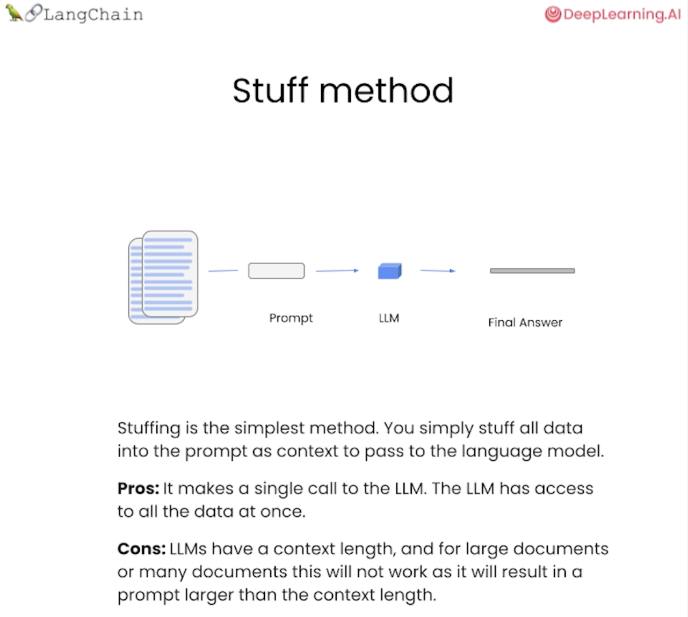

# LangChain Q&A Over Documents - Quick Reference

## Overview
This notebook demonstrates Retrieval-Augmented Generation (RAG) - enabling LLMs to answer questions about your own documents/data using embeddings and vector databases.

## The Problem
LLMs don't know about your specific data:
```python
llm("What shirts do you sell?")
# "I don't have access to current product information..."
```

## The Solution: RAG Pipeline
```
Load → Embed → Store → Retrieve → Answer
```

---

## Core Components

### 1. Document Loader
Load data from files into LangChain documents.

```python
from langchain.document_loaders import CSVLoader

loader = CSVLoader(file_path='products.csv')
docs = loader.load()  # Each row becomes a document
```

**Supported formats:** CSV, PDF, TXT, JSON, HTML, etc.

---

### 2. Embeddings
Convert text to numerical vectors for semantic search.

```python
from langchain.embeddings import OpenAIEmbeddings

embeddings = OpenAIEmbeddings()
embed = embeddings.embed_query("shirt with sun protection")
print(len(embed))  # 1536-dimensional vector
```

**How it works:**
- Similar meanings → Similar vectors
- "sun protection shirt" ≈ "UV blocking tee"
- "sun protection shirt" ≠ "winter jacket"

---

### 3. Vector Store
Database that stores and searches embeddings.

```python
from langchain.vectorstores import DocArrayInMemorySearch

db = DocArrayInMemorySearch.from_documents(
    docs,       # Your documents
    embeddings  # Embedding function
)
```

**Operations:**
```python
# Similarity search
query = "shirt with sunblocking"
results = db.similarity_search(query)  # Returns top 4 matches

# Convert to retriever
retriever = db.as_retriever()
```

---

### 4. RetrievalQA Chain
Combines retriever with LLM for Q&A.

```python
from langchain.chains import RetrievalQA
from langchain.chat_models import ChatOpenAI

llm = ChatOpenAI(temperature=0.0, model="gpt-3.5-turbo")

qa_chain = RetrievalQA.from_chain_type(
    llm=llm,
    chain_type="stuff",  # Stuff all docs into prompt
    retriever=retriever,
    verbose=True
)

response = qa_chain.run("List all shirts with sun protection")
```

**Chain Types:**
- `"stuff"`: Put all docs in one prompt (simple, good for small docs)
- `"map_reduce"`: Process docs separately, then combine
- `"refine"`: Iteratively refine answer
- `"map_rerank"`: Rank answers from each doc

---




## Quick Start (One-Liner)

```python
from langchain.indexes import VectorstoreIndexCreator

# Handles loading, embedding, and indexing automatically
index = VectorstoreIndexCreator(
    vectorstore_cls=DocArrayInMemorySearch,
    embedding=embeddings
).from_loaders([loader])

# Query directly
response = index.query("What shirts have sun protection?")
```

---

## Complete Workflow

### Step-by-Step Approach

```python
# 1. Load documents
from langchain.document_loaders import CSVLoader
loader = CSVLoader(file_path='catalog.csv')
docs = loader.load()

# 2. Create embeddings
from langchain.embeddings import OpenAIEmbeddings
embeddings = OpenAIEmbeddings()

# 3. Build vector store
from langchain.vectorstores import DocArrayInMemorySearch
db = DocArrayInMemorySearch.from_documents(docs, embeddings)

# 4. Create retriever
retriever = db.as_retriever()

# 5. Setup QA chain
from langchain.chains import RetrievalQA
from langchain.chat_models import ChatOpenAI

llm = ChatOpenAI(temperature=0.0)
qa_chain = RetrievalQA.from_chain_type(
    llm=llm,
    chain_type="stuff",
    retriever=retriever
)

# 6. Ask questions
response = qa_chain.run("Your question here")
```

---

## How It Works

### RAG Process Flow

```
User Question: "Shirts with sun protection?"
    ↓
[Convert to Embedding Vector]
    ↓
[Search Vector Database]
    ↓
Top 4 Relevant Documents Retrieved
    ↓
[Stuff into LLM Prompt as Context]
    ↓
LLM Generates Answer Based on Retrieved Docs
    ↓
"Here are our sun protection shirts: ..."
```

### Manual Approach (Understanding the Internals)

```python
# Retrieve relevant docs
docs = db.similarity_search("shirts with sun protection")

# Combine docs
context = "".join([doc.page_content for doc in docs])

# Query LLM with context
response = llm.call_as_llm(
    f"{context}\n\nQuestion: List all shirts with sun protection"
)
```

---

## Key Concepts

### Embeddings
Numerical representations of text that capture semantic meaning.

```python
embeddings.embed_query("Hello")  
# → [0.23, -0.45, 0.12, ..., 0.88]  (1536 numbers)
```

### Similarity Search
Find documents most similar to query based on vector distance.

```python
query = "waterproof jacket"
results = db.similarity_search(query, k=4)  # Top 4 results
```

### Retriever
Abstraction that handles document retrieval automatically.

```python
retriever = db.as_retriever()
# Now qa_chain automatically retrieves relevant docs
```

---

## Common Use Cases

| Scenario | Description |
|----------|-------------|
| **Product Catalogs** | Query inventory for specific items |
| **Documentation** | Answer questions about technical docs |
| **Knowledge Bases** | Search company policies, FAQs |
| **Research Papers** | Find relevant information in papers |
| **Customer Support** | Retrieve relevant help articles |

---

## Important Notes

### Embedding Requirement
Newer LangChain versions require explicit embeddings:

```python
# ❌ Old way (causes error)
index = VectorstoreIndexCreator(
    vectorstore_cls=DocArrayInMemorySearch
).from_loaders([loader])

# ✅ New way
embeddings = OpenAIEmbeddings()
index = VectorstoreIndexCreator(
    vectorstore_cls=DocArrayInMemorySearch,
    embedding=embeddings  # Required!
).from_loaders([loader])
```

### In-Memory Storage
`DocArrayInMemorySearch` stores data in RAM:
- ✅ Fast for development/testing
- ❌ Data lost when program stops
- For production: Use persistent vector stores (Pinecone, Weaviate, Chroma)

---

## Setup Requirements

```python
# Core imports
from langchain.chains import RetrievalQA
from langchain_openai import ChatOpenAI
from langchain.document_loaders import CSVLoader
from langchain.embeddings import OpenAIEmbeddings
from langchain.vectorstores import DocArrayInMemorySearch
from langchain.indexes import VectorstoreIndexCreator

# Install required packages
# pip install langchain langchain-openai docarray
```

---

## Example Output

**Query:**
```python
qa_chain.run("List all shirts with sun protection")
```

**Response:**
```markdown
| Product Name | Description | Price |
|--------------|-------------|-------|
| Men's UPF 50+ Trail Shirt | Lightweight, moisture-wicking | $49.99 |
| Women's Sun Shield Tee | UPF 30, quick-dry fabric | $39.99 |
| Kids' UV Protection Shirt | Fun colors, UPF 40+ | $29.99 |

All shirts feature built-in sun protection and are perfect for outdoor activities.
```

---

## Comparison: Before vs After RAG

**Without RAG:**
```
Q: "What's your cheapest sun protection shirt?"
A: "I don't have access to real-time pricing..."
```

**With RAG:**
```
Q: "What's your cheapest sun protection shirt?"
A: "Our cheapest sun protection shirt is the Youth UV Tee at $24.99, 
    featuring UPF 30 protection and moisture-wicking fabric."
```
